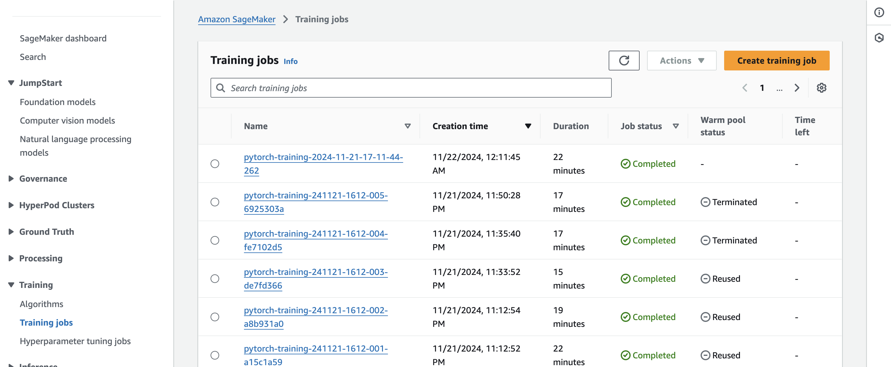
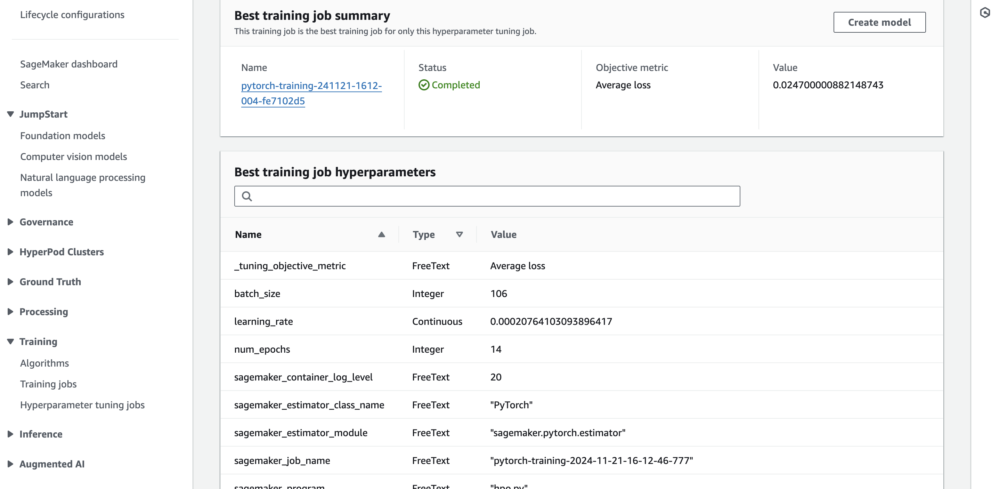
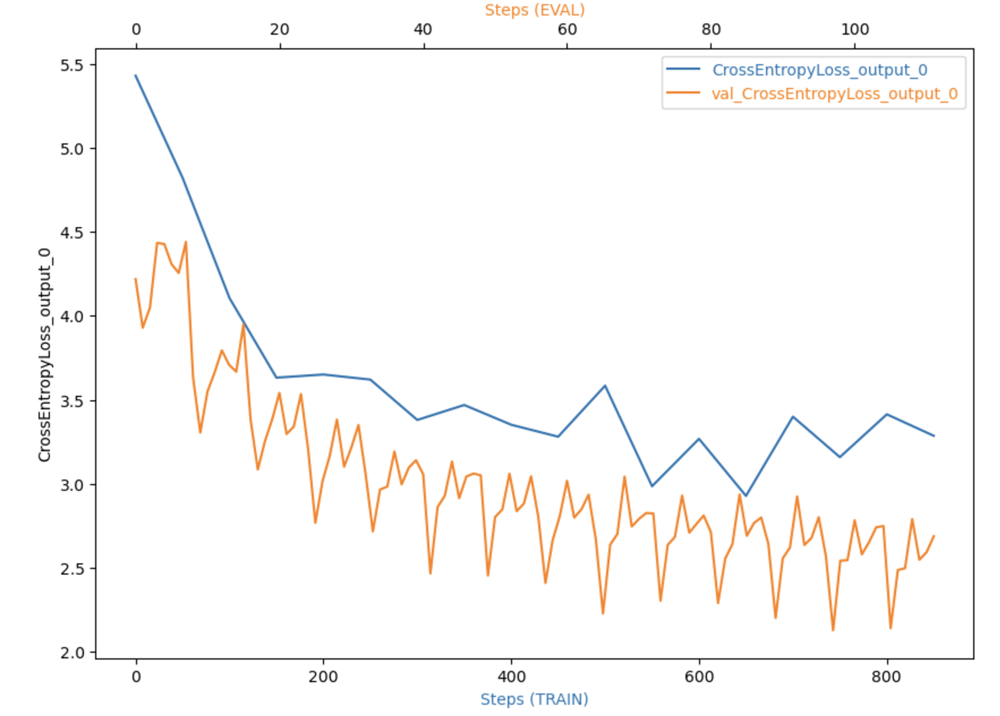
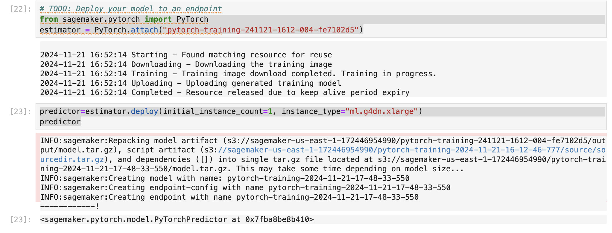
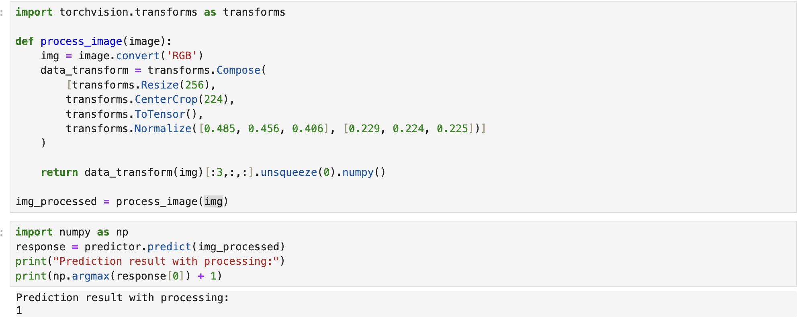
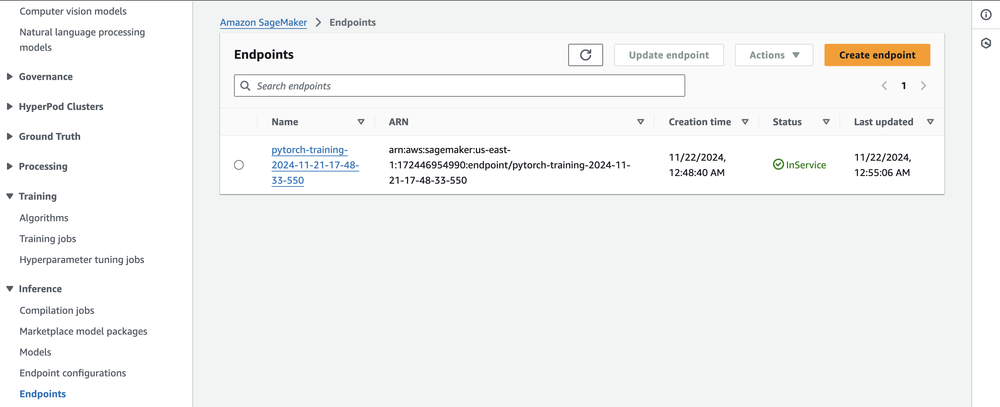

# Image Classification using AWS SageMaker

Use AWS Sagemaker to train a pretrained model that can perform image classification by using the Sagemaker profiling, debugger, hyperparameter tuning and other good ML engineering practices. This can be done on either the provided dog breed classication data set or one of your choice.

## Project Set Up and Installation
Enter AWS through the gateway in the course and open SageMaker Studio. 
Download the starter files.
Download/Make the dataset available. 

## Dataset
The provided dataset is the dogbreed classification dataset which can be found in the classroom.
The project is designed to be dataset independent so if there is a dataset that is more interesting or relevant to your work, you are welcome to use it to complete the project.
```bash
!wget https://s3-us-west-1.amazonaws.com/udacity-aind/dog-project/dogImages.zip
```

### Access
Upload the data to an S3 bucket through the AWS Gateway so that SageMaker has access to the data. 
```bash
session = sagemaker.Session()

bucket = "haont1-bucket"
print("Default Bucket: {}".format(bucket))

region = session.boto_region_name
print("AWS Region: {}".format(region))

role = sagemaker.get_execution_role()
print("RoleArn: {}".format(role))

os.environ["DEFAULT_S3_BUCKET"] = bucket

!aws s3 sync ./dogImages/train s3://${DEFAULT_S3_BUCKET}/data/train/
!aws s3 sync ./dogImages/valid s3://${DEFAULT_S3_BUCKET}/data/valid/
!aws s3 sync ./dogImages/test s3://${DEFAULT_S3_BUCKET}/data/test/
```

## Hyperparameter Tuning
### Model
The chosen model is ResNet-18, a pre-trained convolutional neural network architecture available through PyTorch's torchvision models. Using a pre-trained ResNet-18 allows leveraging transfer learning, significantly speeding up convergence and improving performance, especially when the dataset size is moderate or small. It strikes a good balance between depth and computational efficiency, making it suitable for experimentation and training on limited hardware resources.

```bash
def net(num_classes, pretrained=True):

    model = models.resnet18(pretrained=pretrained)
    for param in model.parameters():
        param.requires_grad = False

    num_features = model.fc.in_features
    model.fc = nn.Sequential(
        nn.Linear(num_features, num_classes),
        nn.Dropout(p=0.5),
        nn.BatchNorm1d(num_classes)
    )

    return model
```
### Training Jobs


### Logs metrics


### Hyperparameters
```bash
#Declare your HP ranges, metrics etc.
hyperparameter_ranges = {
    'batch_size': IntegerParameter(32, 128),
    'learning_rate': ContinuousParameter(1e-4, 5e-2),
    'num_epochs': IntegerParameter(5, 15)
}

objective_metric_name = 'Average loss'
objective_type = 'Minimize'

metric_definitions = [{"Name": "Average loss", "Regex": "Average loss: ([0-9\\.]+)"}]
```

### The best hyperparameters



## Debugging and Profiling
-  I set up SageMaker Debugger Rules to ensure effective monitoring of training performance. I created a ProfilerConfig to collect detailed system performance metrics and used a DebuggerHookConfig to enable logging and data collection at specific intervals
-  In the training script, I setting the mode TRAIN for training and EVAL for evaluation and register the loss function to the hook for tracking its ouputs.
-  I defined the SageMaker PyTorch estimator with: Debugger and Profiler Configurations, Rules and Hyperparameters
-  Training and test datasets were provided using SageMaker TrainingInput
-  Finally, I launched the training job using estimator.fit() with the specified data inputs. After training, I reviewed the logs and reports generated by: SageMaker Studio or Amazon CloudWatch for debugging alerts or Profiler Report for detailed system performance and training inefficiencies.

### Results


More details of the profiler html/pdf file: `ProfilerReport/profiler-output/profiler-report.html`


## Model Deployment
After Hyperparameter Tuning steps, i have identified the best training job. So i created an estimator with the model has been trained
And then deploy to the SageMaker Inference

**NOTE** The SageMaker endpoint doesn't support the `state_dict()`. You must save the model by using the TorchScript or write code to deploy
Finally, process the image and send to the endpoint.


### Deployed active endpoint


## Standout Suggestions
**TODO (Optional):** This is where you can provide information about any standout suggestions that you have attempted.
